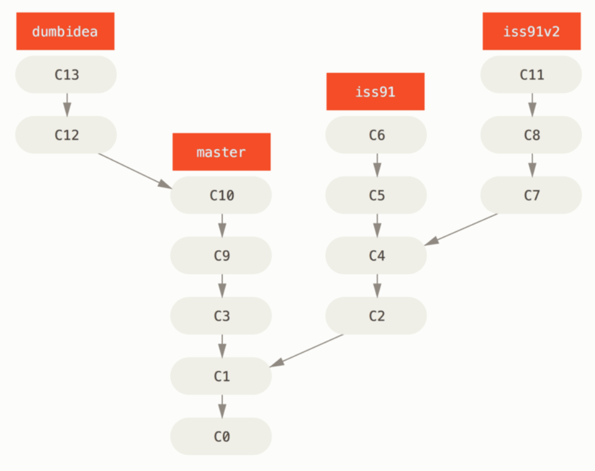

# git学习

## git状态

Git 有三种状态，你的文件可能处于其中之一：已提交（committed）、已修改（modified）和已暂存（staged）。已提交表示数据已经安全地保存在本地数据库中。 已修改表示修改了文件，但还没保存到数据库中。 已暂存表示对一个已修改文件的当前版本做了标记，使之包含在下次提交的快照中。由此引入 Git 项目的三个工作区域的概念：Git 仓库、工作目录以及暂存区域。

Git 仓库目录是 Git 用来保存项目的元数据和对象数据库的地方。 这是Git 中最重要的部分，从其它计算机克隆仓库时，拷贝的就是这里的数据。

工作目录是对项目的某个版本独立提取出来的内容。 这些从 Git 仓库的压缩数据库中提取出来的文件，放在磁盘上供你使用或修改。

暂存区域是一个文件，保存了下次将提交的文件列表信息，一般在 Git 仓库目录中。 有时候也被称作索引，不过一般说法还是叫暂存区域。

基本的 Git 工作流程如下：

1. 在工作目录中修改文件。
2. 暂存文件，将文件的快照放入暂存区域。
3. 提交更新，找到暂存区域的文件，将快照永久性存储到 Git 仓库目录。

如果 Git 目录中保存着的特定版本文件，就属于已提交状态。 如果作了修改并已放入暂存区域，就属于已暂存状态。如果自上次取出后，作了修改但还没有放到暂存区域，就是已修改状态。

## 基本操作命令

初始化仓库:git init
跟踪文件: git add
克隆仓库: git clone
查看文件状态：git status
显示未暂存的变动: git diff
跳过暂存区直接提交: git commit -a
移除文件:git rm
移动文件:git mv
查看提交历史:git log
别名：git config --global alias.别名 原来名称

## 文件.gitignore 的格式规范如下：

- 所有空行或者以 ＃ 开头的行都会被 Git 忽略。
- 可以使用标准的 glob 模式匹配。
- 匹配模式可以以（/）开头防止递归。
- 匹配模式可以以（/）结尾指定目录。
- 要忽略指定模式以外的文件或目录，可以在模式前加上惊叹号（!）取反。

## 仓库

查看远程仓库：git remote 更多信息：git remote show
添加远程仓库：git remote add < shortname > < url>
从远程仓库拉取：git fetch [remote-name]
推送到远程仓库：git push [remote-name] [branch]
远程仓库重命名：git remote rename
远程仓库移除：git remote rm

## 标签

列出已有的标签：git tag
创建标签：
- 轻量标签 lightweight
- 标注标签 annotated
git tag -a 标签的名称 -m 附加信息
（标签可以共享，如：git push origin [tagname]）

## 分支

### 文件的保存

### 基本操作
分支创建：git branch 分支名称
切换分支：git checkout 已存在的分支名称
创建分支并且切换到这个分支：git checkout -b 分支名称
查看分支所指向的对象:git --decorete
查看分叉历史：git log --oneline --decorate --graph --all
删除分支：git branch -d 分支名称
删除远程分支：git push origin --delete 分支名称
强制删除：git branch -D
合并分支：git merge 分支名称
同步分支数据：git fetch origin

### 分支创建于合并的简单case

1. 开发某个网站。

2. 为实现某个新的需求，创建一个分支。

3. 在这个分支上开展工作。

正在此时，你突然接到一个电话说有个很严重的问题需要紧急修补。 你将按照如下方式来处理：

1. 切换到你的线上分支（production branch）。

2. 为这个紧急任务新建一个分支，并在其中修复它。

3. 在测试通过之后，切换回线上分支，然后合并这个修补分支，最后将改动推送到线上分支。

4. 切换回你最初工作的分支上，继续工作。

主要用到的就是git branch、checkouts

### 分支开发工作流

#### 长期分支

#### 特性分支
特性分支是一种短期分支，它被用来实现单一特性或其相关工作。

#### 变基
整合不同分支有两种方法：merge和rebase
变基相当于把分支上所做的修改复制到另一个分支上，看起来就像是这个分支做了这些操作一样。

使用它要遵守一条准则：**不要对在你的仓库外有副本的分支执行变基.**

变基操作的实质是丢弃一些现有的提交，然后相应地新建一些内容一样但实际上不同的提交。 如果你已经将提交推送至某个仓库，而其他人也已经从该仓库拉取提交并进行了后续工作，此时，如果你用 git rebase 命令重新整理了提交并再次推送，你的同伴因此将不得不再次将他们手头的工作与你的提交进行整合，如果接下来你还要拉取并整合他们修改过的提交，事情就会变得一团糟。

变基操作：git rebase [basebranch] [topicbranch]
