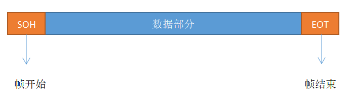
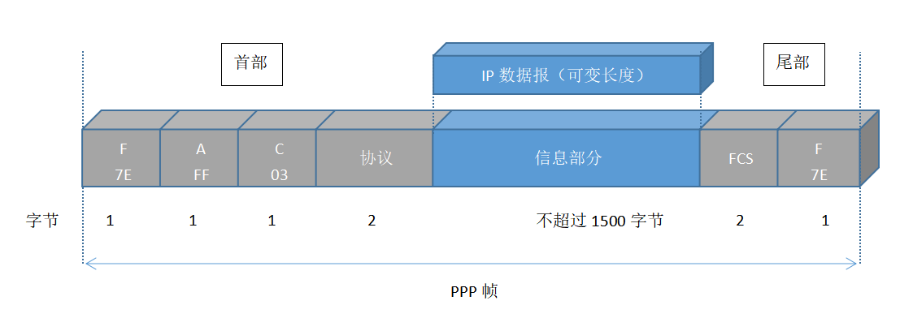
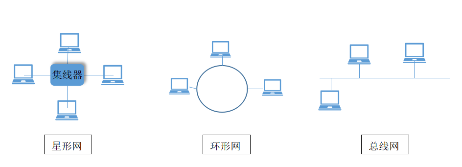

在这一层所要研究的是在**同一个局域网**中，分组怎样**从一台主机传送到另一台主机，但并不经过路由器转发**。本章主要内容有：

1. 数据链路层的点对点信道和广播信道的特点以及；两种信道所使用的协议（PPP协议以及CSMA/CD协议）
2. 数据链路层的三个基本问题：封装成帧，透明传输，差错检测。
3. 以太网的MAC层硬件地址
4. 适配器、转发器、集线器、网桥、以太网交换机的作用和使用场合。

数据链路层所使用的信道主要有以下两种类型：
1. 点对点信道
这种信道使用一对一的点对点通信方式

2. 广播信道
这种信道使用一对多的广播通信方式。

# 使用点对点信道的数据链路层

## 数据链路和帧

链路是从一个结点到相邻结点的一段物理线路（有线或无线），而数据链路是实现一些必要协议的软硬件附加在链路上所构成的。现常用网络适配器来实现这些协议，一般都包含了数据链路层和物理层的功能。

点对点信道的数据链路层在进行通信是的主要步骤如下：
1. 结点A的数据链路层把网络层交下来的IP数据报添加首部和尾部封装成帧。
2. 结点A把封装好的帧发送给结点B的数据链路层。
3. 若结点B的数据链路层收到的真无差错，则从收到的帧提取出IP数据报交给上面的网络层，否则丢弃。

## 三个基本问题
1. 封装成帧
在数据的前后分别加上首部和尾部，它们的一个作用是进行帧定界，包含着许多控制信息。数据链路层所能传送的帧的**数据部分长度上限**称为MTU。帧定界可以使用特殊的帧定界符，避免与数据部分出现冲突。

2. 透明传输
透明的含义是某个实际存在的东西看起像是不存在一样，比如玻璃。透明传送数据表示无论什么样的比特组合成的数据，都能够按照原样没有差错地通过这个数据链路层。透明传输问题即当数据部分和帧定界符出现冲突的问题。具体方法是在数据中出现含有帧定界符的位置的前面插入一个转义字符“ESC”，如果数据中也出现了这个转移字符也同样操作，在接收端中检测到这个转移字符时则去掉这个转义字符。这种方法称为**字符填充或字节填充**。

3. 差错检测
当比特在传输中可能由1变为0或者从0变为1，这种叫做比特差错。数据链路层的差错检测能够检测出**帧的比特错误**，常常采用的检测技术为循环冗余码CRC技术。其主要目的为在原本所要发送的数据M后面加上n位冗余码，然后将这个数据发送出去。冗余码计算方法为：双方事先约定取一个n+1位除数P，在M后面加上n个0作为被除数，被除数和除数做模2除法，所得到的余数即为冗余码R。除数P可以采用多项式表示，如P(x) = x^3 + x^2 + 1，那么P=1101。

前面之所以说能检测出帧的比特错误而不说**传输差错**是因为传输差错包含了比特差错和帧丢失、帧重复和帧失序，它不包含后面三种，所以“无比特差错”并不等同于“无传输差错”。

# 点对点协议PPP

用户接入互联网通常需要连接到某个ISP，而PPP协议就是用户计算机和ISP进行通信时所使用的数据链路层协议。PPPoE是为宽带上网的主机使用的链路层协议，它把PPP帧再封装在以太网帧中。

PPP协议需要满足的需求：
1. 简单
2. 封装成帧
3. 透明性
4. 多种网络层协议
5. 多种类型链路
6. 差错检测
7. 检测连接状态
8. 最大传送单元
9. 网络层地址协商
10. 数据压缩协商

## PPP协议的帧格式

F（Flag）：标志字段，表示一个帧的开始或结束。
A和C是控制字段，没给出定义。
协议字段：如0X0021则表示信息字段是IP数据报。
信息字段长度是可变的，但不超过1500个字节。
FCS是使用CRC的帧检验序列FCS。

如果信息字段中出现和这些控制字段一样的值，可采用字节填充和零比特填充法。如采用字节填充法则对0x7E字节转变成2字节序列（0x7D,0x5E），采用零比特填充则在连续五个1（不管后面有没有1）的后面填充一个0，在接收端则把这些填充的数据去除。

## PPP协议的工作状态

当用户拨号接入ISP时，就建立了一条从用户个人电脑到ISP的物理连接，此时个人电脑向ISP发送一系列链路控制协议LCP分组，建立LCP链路，接着是进行网络层的配置，网路控制协议NCP给接入的新用户分配一个临时IP。当用户通信完毕后，NCP释放网络层连接，收回原来分配的IP地址，接着LCP释放数据链路层连接，最后是物理层的连接。

# 使用广播信道的数据链路层

广播信道可以进行一对多的通信，下面讨论的局域网使用的就是广播信道。

## 局域网的数据链路层

局域网的特点为**网络为一个单位所拥有，其地理范围和站点数目有限。**它具有如下优点：
1. 具有广播功能，从一个站点可以方便地访问全网。
2. 便于系统的扩展和逐渐演变。
3. 提高了系统的可靠性、可用性和生存性。

网络拓扑：

实现共享信道的技术有两种：

1. 静态划分信道
如频分复用、码分复用等。

2. 动态媒体接入控制
又称为多点接入，其特点是信道并非在用户通信时固定分配给用户。

- 随机接入
所有用户可以随时地发送信息，但如果恰巧多个用户同时发送则产生碰撞，因为必须要有解决碰撞的网路协议。

- 受控接入
用户不能随机地发送消息，必须服从一定的控制，其代表有轮询。

## CSMA/CD协议

最初的以太网使用总线网拓扑，采用简单的随机接入，当总线上没有计算机在发送数据时，则其他想要发送数据的计算机就会发起请求，但如果碰巧有计算机同时发送产生了碰撞，那么这些计算机就立即停止发送，再次等待信道空闲发起请求传输数据。这种协调方式叫做CSMA/CD协议，意思是载波监听多点接入/碰撞检测。

CSMA/CD协议的要点：
1. 多点接入
计算机以多点接入的方式连接在一根总线上。

2. 载波监听
不管发送前还是发送中，每个站都必须不停地检测信道。

3. 碰撞检测
边发送边监听，即适配器边发送数据边检测信道上的信号电压的变化情况，当几个站同时发送数据时总线上的信号电压变化幅度会增大到一定的门限值。在局域网分析中常吧单程端到端传播时延记为τ，发送数据的站知道在本次传输中是否产生碰撞的最迟时间为2τ，这个时间也称为争用期或碰撞窗口。

在使用CSMA/CD协议是，一个站不能同时进行发送和接收（但必须边发送边监听信道），所以采用CSMA/CD协议的以太网不能进行全双工通信。

当信号产生碰撞时，以太网使用截断二进制指数退避算法来确定碰撞后重传的时机。

在以太网中，凡是长度小于64字节的帧都是由于冲突而异常中止的无效帧。因为如果一个帧很短，当站点发送完后便不再对它进行监听，但有可能这个帧在传输过程中产生了碰撞，结果发送端没检测到。为了避免此情况，以太网规定了最短帧为64字节，如果数据少于64字节则填充。之所以设置这个值是由于在10M bit/s以太网中，发送512bit的时间需要51.2μs，也就是等于争用期。如果发送的数据在争用期期间都没有检测到碰撞，则传输就肯定不会产生碰撞。

CSMA/CD协议的要点归纳如下：
1. 准备发送
获取网络分组，加上以太网首部和尾部封装成帧

2. 检测信道
检测到信道在96比特时间内保持空闲在发送这个帧

3. 边发送边监听
- 发送成功
在争用期内为检测到碰撞

- 发送失败
在争用期内检测到碰撞，立即停止发送，采用退避算法返回第2步。

以太网从总线网演变成了星形网，集线器在起着重要作用。使用集线器的以太网在逻辑上仍然是一个总线网，各站共享逻辑总线，使用的还是CSMA/CD协议。集线器工作在物理层，它的每个接口值简单地转发比特，不进行碰撞检测。

多个站在以太网上工作可能会发生碰撞造成资源浪费，所以就涉及到了以太网信道利用率的问题。如下图所示，要提高以太网信道利用率，需要减少τ/T0，它是以太网单程端到端时延τ与帧的发送时间T0之比，记为α=τ/T0。当α越小就能越快检测出碰撞，也就是当信道速率一定时，以太网的长度会受到限制，发送的帧不能太短。极限信道利用率Smax = T0/T0+τ = 1/1+α。

## 以太网的MAC层
在局域网中，硬件地址又称为物理地址或MAC地址，它在生产的时候被生产商烧在适配器的ROM中，所以是不能被改变的。

适配器具有过滤功能，当接收到MAC帧时先检查MAC帧中的目的地址没如果是发往本站的则接受，否则丢弃。这些帧分为以下三种：

1. 单播帧
一对一，MAC地址与本站的硬件地址相同的帧

2. 多播帧
一对全体，即发送给本局域网的全部站点的帧

3. 广播帧
一对多，发送给本局域网上一部分站点的帧

以下是MAC帧格式示意图：

以太网在传送帧的时候，各帧之间有一定的间隔，因此，在接收端找到帧开始定界符后其后面连续到达的比特流都属于同一个MAC帧，所以以太网帧不适用帧结束定界符。

# 扩展的以太网

1. 在物理层扩展
以太网主机的距离不能太远，否则信号衰减会使CSMA/CD协议不能工作，可以使用转发器进行扩展，也可以采用光纤和光纤调制器进行扩展，因为光纤时延很小，带宽很宽。

2. 在数据链路层扩展
一开始利用**网桥**对收到的帧根据其MAC地址的目的地址进行转发和过滤，
发展到后来使用交换式集线器，也称为**以太网交换机或第二层交换机**。以太网交换机的本质是多接口的网桥，是一种即插即用设备，可以通过**自学习算法**建立一张帧**交换表（地址表）**。一开始这张表是空的，现在假设有ABCD四台计算机，分别接在交换机的1234四个接口。A要发送帧给B，交换机会先搜索交换表，发现没找到应该从哪个接口转发出去，于是先把MAC地址为A，接口为1记录下来，然后向本局域网广播这个帧。CD接受到这个帧后发现目的MAC地址不是自己，所以将其丢弃，只有B接收了下。然后B又像A发送帧，交换机搜索到了A所在的接口，马上从1接口转发，同时也记下B的MAC
地址和对应的接口。
以太网交换机不使用共享总线，没有碰撞问题，也就不使用CSMA/CD协议，能够以全双工方式工作。虽然不使用CSMA/CD协议，但帧格式并未改变，所以还是叫以太网。

3. 虚拟局域网
虚拟局域网VLAN只是局域网提供给用户的一种服务，而不是一种新型局域网。它是由一些局域网网段构成的与物理位置无关的逻辑组。

