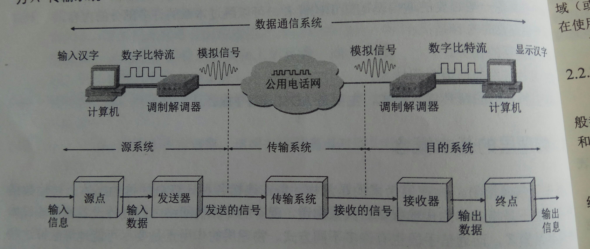
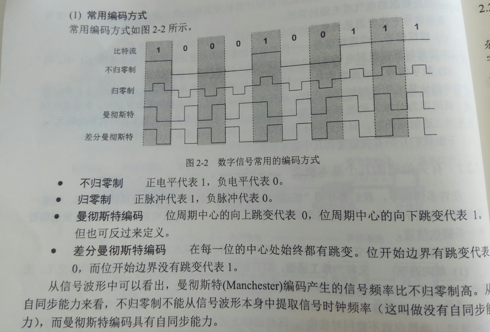
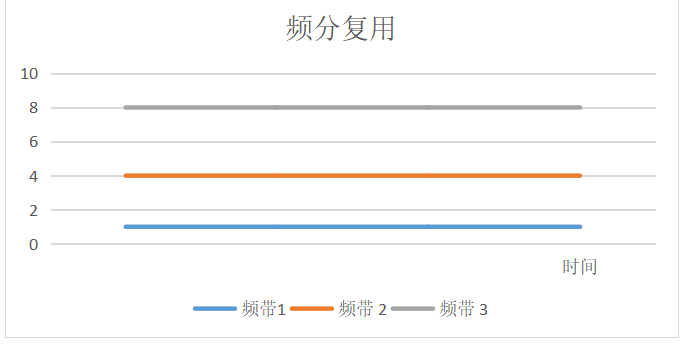
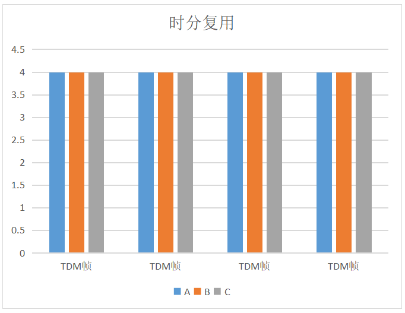
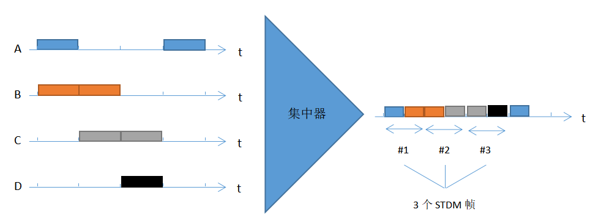

# 基本概念
物理层考虑的是如何传输数据比特流，而不是具体的传输媒体。用于物理层的协议也常称为物理层规程。物理层的主要任务描述为确定与传输媒体的接口有关的一些特性：

1. 机械特性
接口所用接线器的形状和尺寸等。

2. 电气特性
电缆的电压范围

3. 功能特性
某一电平的电压意义

4. 过程特性
对于不同功能的各种可能事件出现的顺序

# 数据通信的基础知识

## 数据通信系统的模型
一个数据通信系统可分为三大部分：

1. 源系统
- 源点
源点设备产生需要传输的数据，比如从计算机键盘输入汉字，计算机产生输出的数字比特流。

- 发送器
通常源点产生的数字比特流需要通过发送器编码后才能在传输系统进行传输。

2. 传输系统

3. 目的系统
- 接收器
接收从传输系统传过来的信号，并转换为能够被目的设备处理的信息。

- 终点
终点设备从接收器获取传过来的数字比特流，然后把信息输出。

通信的目的是传送**消息**，比如文字语音等，**数据**则是运行消息的实体。**信号**则是数据的电气或电磁的表现。

根据信号中代表消息的参数的取值不同，信号可以分为以下两大类：模拟信号和数字信号。模拟信号表示消息的参数的取值是连续的，而数字信号则是离散的。在数字信号中国，代表不同离散值的基本波形就称为码元，在二进制中只有两种，分别代表0状态和1状态。

## 有关信道的基本概念
信号和电路并不等同，它一般用来表示向某一方向传输消息的媒体，因此一条通信电路往往包含一条发送信道和一条接收信道。

通信双方有三种基本交互方式：

1. 单工通信
只能有一个方向的通信而没有反向的交互，比如电视广播。需要一条信道。

2. 半双工通信
通信双方都可以发送消息，但不能同时发，比如对讲机。需要两条信道，每个方向各一条。

3. 全双工通信
通信双方可以同时发送和接收。需要两条信道，每个方向各一条。

来自信源的信号称为**基带信号**，其常包含较多低频成分，所以需要进行**调制**。调制可分类两大类：

1. 基带调制
对基带信号的波形进行变换，变换后仍是基带信号。它把数字信号转变为另一种数字信号，所以也把这个过程称为编码。

2. 载波调制
把基带信号的频率范围搬移到较高的频段，并转化为模拟信号，调制后的信号称为带通信号。

常用的编码方式：

## 信道的极限容量
信道在传输的过程中不可避免地会受到影响造成失真，但在接收端如果能从失真的信号中识别出原来的信号，那么这种失真对通信不会有影响。码元传输速率越高，或信号传输的距离越远，或噪声干扰越大，或传输媒体质量越差，则在接收端的波形的失真越严重。限制码元在信道上的传输速率有两个因素：

1. 信道能通过的频率范围
如果信号中的高频分量在传输时受到衰减，那么在接收端收到的波形前后沿不会那么陡峭，每个码元之间的分界也不再很明确。这种现象叫做码间串扰。**奈氏准则：在任何信道中，码元传输的速率是有上限的，传输速率超过此上限。就会出现严重的码间串扰问题，使接收端对码元的识别称为不可能。**

2. 信噪比
**香农公式：C=W ㏒₂(1+S/N)**

C是信道的极限信息传输速率，W为信道的带宽，S是信道内所传信号的平均功率，N是信道内部的高斯噪声功率。香农公式表明**信道的带宽或信道的噪声比越大，信息的极限传输速率越大。**它的意义在于**只要信息传输速率低于信道的极限传输速率，就一定存在某种办法来实现无差错的传输。**

从上面公式可以看出，对于频带宽度已确定的信道，如果信噪比达到最高后就不能改变其传输速率了，所为了提高信息的传输速率，可以让一个码元携带更多比特的信息量。比如原本是110，每一个码元携带1比特信息，可以采用3比特编为一组，共有8组，而每一组用一种振幅表示，这样一个码元就可以携带3比特的信息了。

# 传输媒体

传输媒体也称为传输介质，它是数据传输系统中的物理通路。传输媒体可以分为两大类：

1. 导引型传输媒体
在导引型传输媒体中，电磁波被引导沿着固体媒体传播。

- 双绞线
- 同轴电缆
- 光缆

2. 非导引型传输媒体
非引导性传输媒体就是指自由空间。在非引导性传输媒体中，电磁波的传输通常称为无线传输。

- 短波
- 微波

# 信道复用技术

信道复用就是使用一个共享信道完成多个接收端与发送端之间的通信。

## 频分复用、时分复用、统计时分复用

频分复用：各用户分配到一个在一定范围内的频率，在通信过程中始终占用这个频带。

时分复用：用户被固定配分到一个时间段，在这个时间段内完成自己的通信。

统计时分复用是改进的时分复用，用集中器连接低速用户。用户有了数据就随时发送到集中器的输入缓存，集中器按顺序依次扫描输入缓存，把缓存中输入的数据放入STDM帧中。对没有数据的缓存 就跳过，当一个帧满了之后就发送出去。

## 波分复用
即光的频分复用。

## 码分复用
码分复用CDM是另一种共享信道的方法，实际上人们常用的名词是码分多址CDMA。由于各用户使用经过特殊挑选的不同码型，因此各用户之间不会造成干扰。在CDMA中，每一个比特时间被划分为m个更短的间隔，称为码片。使用CDMA的每一个站被指派一个唯一的m位码片序列，如果要发送1则发送自己的m位码片序列，发送0则发送该码片序列的反码。为了方便，将码片的0写出-1,1写为+1，如S站的码片为11001则为（+1,+1,-1,-1,+1）。各个站的码片不仅必须各不相同，还需要互相正交，其规格化内积为：S·T=1/m（S1T1+S2T2+……+SmTm）。假定X站要接收S站的数据，则使用S站码片向量与接收到的位置信号进行规格化内积运算。所有其他站的信号都被过滤（结果为0），S站发送比特1则结果为+1，发送0比特则结果为-1。

