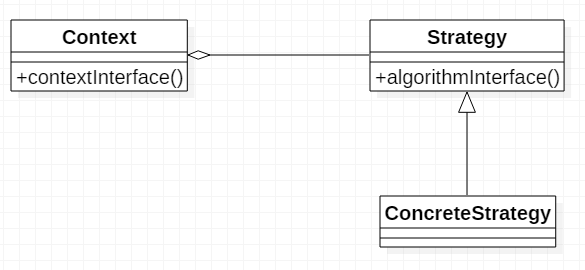
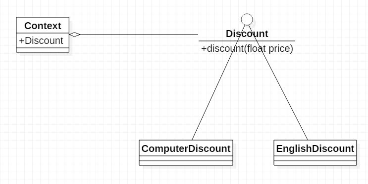

# 策略模式

## 定义

## 通用类图

说明：Strategy是算法接口，ConcreteStrategy是算法的具体实现，Context作用就是将算法封装起来。

## 通用代码
~~~java
// 策略
public interface Strategy {
    public void doSomething();
}

// 具体策略
public class ConcreteStrategy implements Strategy {
    @Override
    public void doSomething() {
        // 具体算法
    }
}

// 算法封装
public class Context {
    private Strategy strategy;

    public Context(Strategy strategy) {
        this.strategy = strategy;
    }

    public void doSomething() {
        strategy.doSomething();
    }
}

// 客户端调用
public class Client {

    public static void main(String[] args) {
        Strategy strategy = new ConcreteStrategy();
        Context context = new Context(strategy);
        context.doSomething();
    }
}

~~~

## 样例展示
在图书销售时，根据不同类型的图书有不同的折扣，计算金额时必须区别对待，例如计算机类图书7折，英语类图书6折。

分析：这里的策略是打折，具体打折策略是计算机7折，英语6折，然后将这些打折策略封装起来给客户端调用。

### 样例类图

### 样例代码
~~~java
// 策略接口
public interface Discount {
    public float discount(float price);
}

// 计算机打7折
public class ComputerDiscount implements Discount {
    @Override
    public float discount(float price) {
        return (float) (price * 0.7);
    }
}

// 英语打6折
public class EnglishDiscount implements Discount {
    @Override
    public float discount(float price) {
        return (float) (price * 0.6);
    }
}

// 封装算法
public class Context {

    private Discount discount;

    public Context(Discount discount) {
        this.discount = discount;
    }

    public float sale(float price) {
        return discount.discount(price);
    }
}

// 客户端调用
public class Client {

    public static void main(String[] args) {
        Scanner scanner = new Scanner(System.in);
        float price = scanner.nextFloat();
        String classification = new Scanner(System.in).next();
        Context context = null;
        if ("计算机".equals(classification)) {
            context = new Context(new ComputerDiscount());
        } else if ("英语".equals(classification)) {
            context = new Context(new EnglishDiscount());
        }

        System.out.println(context.sale(price));
    }
}
~~~

当然，这里可以巧用枚举完成相同的功能
~~~java
public enum Discount {
    COMPUTER_DISCOUNT() {
        @Override
        public float discount(float price) {
            return (float) (price * 0.7);
        }
    },
    ENGLISH_DISCOUNT() {
        @Override
        public float discount(float price) {
            return (float) (price * 0.6);
        }
    };

    public abstract float discount(float price);
}

// 客户端调用
 public static void main(String[] args) {
        Scanner scanner = new Scanner(System.in);
        float price = scanner.nextFloat();
        String classification = new Scanner(System.in).next();
        if ("计算机".equals(classification)) {
            System.out.println(Discount.COMPUTER_DISCOUNT.discount(price));
        } else if ("英语".equals(classification)) {
            System.out.println(Discount.ENGLISH_DISCOUNT.discount(price));
        }
    }
~~~

> 本文为《设计模式之禅》读后笔记总结