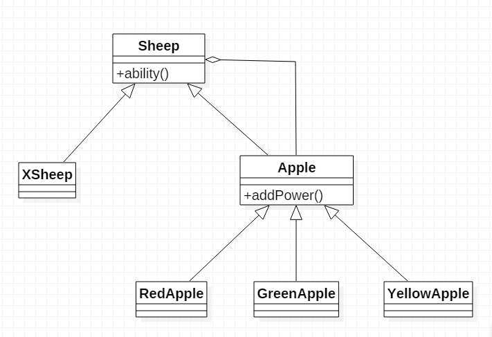

# 装饰模式

## 定义
动态地给一个对象添加额外的职责，就增加功能来说，它比生成子类更加灵活。

## 通用类图

Component是抽象构建，也就是最原始的不加以装饰的类，ConcreteComponent是实现具体的操作。Decorator是修饰者，它持有一个Component对象引用，利用这个引用添加修饰，而ConcreteDecorator是具体的修饰，修饰相应的功能。

## 通用代码
~~~java
// 抽象构建
public abstract class Component {
    public abstract void operate();
}

// 实现
public class ConcreteComponent extends Component {
    @Override
    public void operate() {
        // 原始的操作
    }
}

// 抽象装饰者
public abstract class Decorator extends Component{

    private Component component;

    public Decorator(Component component) { // 构造注入
        this.component = component;
    }

    @Override
    public void operate() {
        this.component.operate();
    }
}

// A装饰
public class ConcreteDecoratorA extends Decorator {

    public ConcreteDecoratorA(Component component) {
        super(component);
    }

    public void methodA() {
        // 自己需要进行额外操作的方法
    }

    @Override
    public void operate() {
        methodA();
        super.operate();
    }
}

// B装饰
public class ConcreteDecoratorB extends Decorator {

    public ConcreteDecoratorB(Component component) {
        super(component);
    }

    public void methodB() {
        // 自己需要进行额外操作的方法
    }

    @Override
    public void operate() {
        methodB();
        super.operate();
    }
}

// 客户端调用
public class Client {

    public static void main(String[] args) {
        Component component = new ConcreteComponent(); // 原始构件，不加任何修饰
        component = new ConcreteDecoratorA(component); // 给它添加A功能
        component = new ConcreteDecoratorB(component); // 再给他添加B功能;

        component.operate(); // 处理原始的功能操作，还拥有A、B的功能
    }
}

~~~

## 样例展示
假如有这么一个“喜羊羊逃命”游戏：喜羊羊被灰太狼追，喜羊羊最多5条命，灰太狼每咬到喜羊羊一次，喜羊羊就要少一条命。在逃的过程中喜羊羊可以吃到三种苹果，吃“红苹果”可以给喜羊羊加上保护罩，吃“绿苹果”可以加快喜羊羊奔跑速度，吃“黄苹果”可以使喜羊羊趟着水跑。

分析：最开始的喜羊羊平平凡凡，但是吃了苹果便可以获得不同的能力。假如不用装饰模式，为了表示吃了相应苹果获得不同能力的喜羊羊，我们需要继承喜羊羊生成6中超能力喜羊羊子类，可谓是复杂。通过装饰模式，实现三种装饰，每包装一个喜羊羊就获得一种相应的能力，大大降低了类的耦合性。

### 样例类图

### 代码展示
~~~java
// 抽象的羊
public abstract class Sheep {
    public abstract void ability();
}

// 喜羊羊
public class XSheep extends Sheep {
    @Override
    public void ability() {
        System.out.println("能力平平");
    }
}

// 抽象苹果，相当于抽象装饰者
public abstract class Apple extends Sheep {

    private Sheep sheep;

    public Apple(Sheep sheep) {
        this.sheep = sheep;
    }

    // 获得超能力
    public abstract void addPower();

    @Override
    public void ability() {
        this.sheep.ability(); // 这句代码别忘了
        addPower();
    }
}

public class RedApple extends Apple {

    public RedApple(Sheep sheep) {
        super(sheep);
    }

    @Override
    public void addPower() {
        System.out.println("获得保护罩");
    }

}

public class GreenApple extends Apple {
    public GreenApple(Sheep sheep) {
        super(sheep);
    }

    @Override
    public void addPower() {
        System.out.println("获得加速能力");
    }
}

public class YellowApple extends Apple {
    public YellowApple(Sheep sheep) {
        super(sheep);
    }

    @Override
    public void addPower() {
        System.out.println("获得趟着水跑的能力");
    }
}

// 客户端调用
public class Client {

    public static void main(String[] args) {
        Sheep xi = new XSheep();
        xi.ability(); // 平凡的喜羊羊

        // 添加超能力
        xi = new RedApple(xi); // 获得保护罩
        xi = new GreenApple(xi); // 获得加速
        xi = new YellowApple(xi); // 趟着水跑
        xi.ability();
    }
}
~~~

> 本文为《设计模式之禅》读后笔记总结