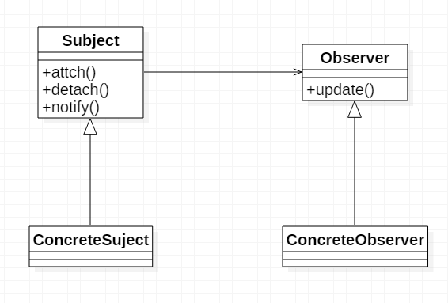
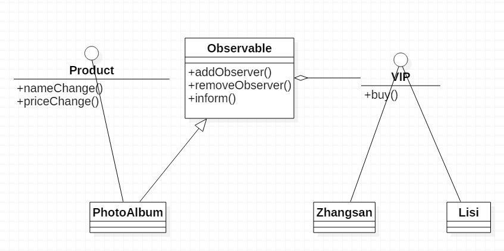

# 观察者模式

## 定义
观察者模式也叫发布订阅模式。它定义对象间一对多的依赖关系，使得一个对象的状态发生改变的时候，则所有依赖于它的对象都得到通知并且自动更新。

## 通用类图

说明：`Observer`是观察者的抽象类，`ConcreteObserver`是具体的观察者，它持有一个更新方法，当被观察者状态改变的时候会调用，触发更新。`Subject`是被观察者抽象类或者实现类，里面三个方法分别是绑定观察者、解绑观察者、通知观察者。`ConcreteSubject`是被观察者的具体实现，当他具体做了什么事或者自己某种状态改变的时候，就会通知观察者并调用其更新方法。

## 通用代码
~~~java
// 观察者接口
public interface Observer {
    public void update(); // 更新
}

// 具体观察者，要更新些什么东西
public class ConcreteObserver implements Observer {
    @Override
    public void update() {
        // 更新信息
    }
}

// 被观察者抽象类
public abstract class Subject {
    private ArrayList<Observer> observers = new ArrayList<>();

    public void attach(Observer observer) {
        observers.add(observer);
    }

    public void detach(Observer observer) {
        observers.remove(observer);
    }

    public void notifyObserver() {
        for (Observer o : observers) {
            o.update();
        }
    }
}

// 具体被观察者
public class ConcreteSubject extends Subject {

    public void doSomething() {
        /**
         * 实行自己的业务
         * ……实行完了
         */

        // 通知观察者
        notifyObserver();
    }
}

// 客户端调用
public class Client {

    public static void main(String[] args) {
        Observer o = new ConcreteObserver();
        ConcreteSubject s = new ConcreteSubject();
        s.doSomething();
    }
}
~~~

## 样例展示
网上商店中如果商品（product）在名称（name）、价格（price）等方面有变化，系统能自动通知会员，将是网上商店区别传统商店的一大特色。

分析：首先找出观察者——会员，被观察者——商品。观察者在观察到动静后肯定会有锁动静，可以给他一个方法。被观察触发更新的条件是自己的名字改变或者价格有变动，那么就可以在这两个方法中调用观察者的方法了。

### 样例类图

### 样例代码
~~~java
// 会员
public interface VIP {
    public void buy(String change);
}

public class ZhangSan implements VIP {

    @Override
    public void buy(String change) {
        System.out.println(change);
        System.out.println("张三：二话不说，买！");
    }
}

public class Lisi implements VIP {

    @Override
    public void buy(String change) {
        System.out.println(change);
        System.out.println("李四：再观望观望！");
    }
}

// 被观察者抽象类
public abstract class Observable {

    private ArrayList<VIP> vips = new ArrayList<>();

    public void addObserver(VIP vip) {
        vips.add(vip);
    }

    public void removeObserver(VIP vip) {
        vips.remove(vip);
    }

    public void inform(String message) {
        for (VIP v : vips) {
            v.buy(message);
        }
    }
}

// 商品接口
public interface Product {

    public void nameChange(String name);
    public void priceChange(float price);
}

// 具体商品
public class PhotoAlbum extends Observable implements Product {

    @Override
    public void nameChange(String name) {
        String message = "商品改名为" + name + "了";
        super.inform(message);
    }

    @Override
    public void priceChange(float price) {
        String message = "商品价格改为" + price + "了";
        super.inform(message);
    }
}

// 客户端调用
public class Client {

    public static void main(String[] args) {
        VIP zs = new ZhangSan();
        VIP ls = new Lisi();

        Observable photoAlbum = new PhotoAlbum();
        photoAlbum.addObserver(zs);
        photoAlbum.addObserver(ls);
        ((PhotoAlbum) photoAlbum).nameChange("小岛藤子写真集");
        ((PhotoAlbum) photoAlbum).priceChange(18);
    }
}
~~~

> 本文为《设计模式之禅》读后笔记总结